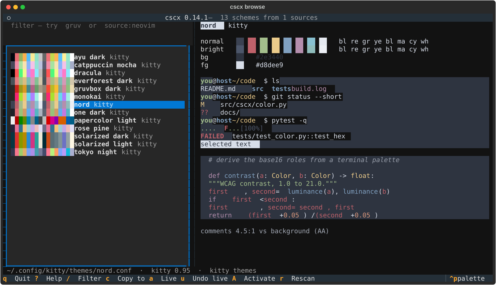
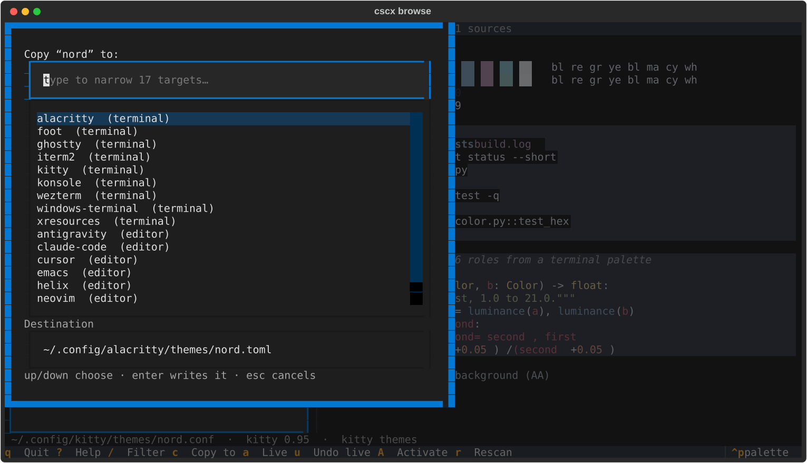
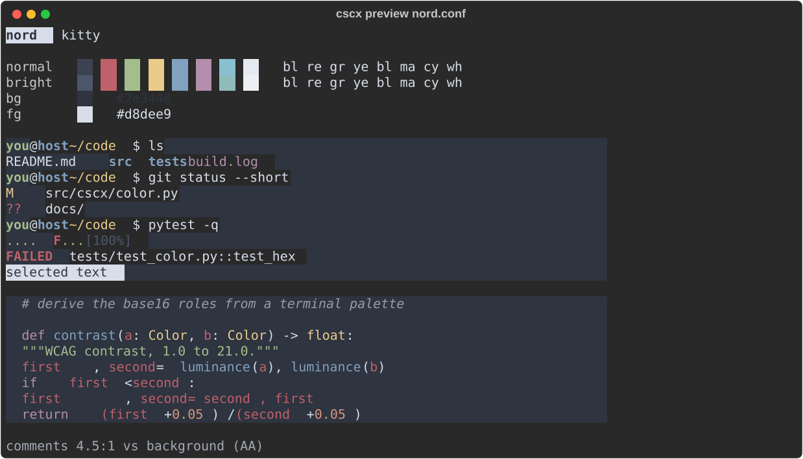

# cscx

Easily convert your favorite colour scheme to all your terminals, editors and command line tools / TUIs.

You already have the scheme you want. It's in kitty's config, or a konsole `.colorscheme`, or a neovim colorscheme you've used for years. `cscx` reads it and writes it out anywhere else: nine terminal formats, eight editors, in any direction.

```console
$ cscx browse                                          # find, preview, apply
$ cscx convert Gruvbox.colorscheme --to kitty          # one file, another format
$ cscx convert kitty.conf --to all -o ./out            # every format at once
```

Existing tools go one way only: base16 and themer generate from a palette you author in *their* format, pywal generates from a wallpaper, colortty converts *to* alacritty. None of them read the scheme you already have.



## Install

Not on PyPI yet, so install from a clone:

```console
$ git clone https://github.com/jcristovao/colorscheme-converter.git cscx && cd cscx

$ pipx install .               # the converter — no dependencies at all
$ pipx install '.[tui]'        # …and `cscx browse` too (pulls in Textual)
```

Python 3.11+. `pip install .` works the same way if you would rather it went into the current environment, and `pipx install --editable '.[tui]'` tracks your changes to the clone.

`[tui]` is an *extra*, not a package: it names the optional dependency group in `pyproject.toml`, which contains Textual and nothing else. `cscx browse` is the only command that needs it — every other one runs on the standard library. The quotes are for the shell, which would otherwise try to glob `[tui]`.

Installing also puts `man cscx` in place.

## The browser

That picture is `cscx browse`, and it is the fastest way to use any of this. It finds the schemes already on your machine — you do not have to know where they live — shows you what each one actually looks like, and gives you one key each for the three things you want to do with one:

| | |
|---|---|
| `a` | **try it right now.** Recolours this terminal instantly. `u` puts it back, and so does quitting. |
| `c` | **copy it** to another format or editor, into the directory that application really reads themes from |
| `A` | **install it** for an application, so it survives a restart — after showing you the plan |

Plus `/` to filter (fuzzily — `b16sulph` finds `base16-atelier-sulphurpool`), `j`/`k` or the arrows to move, and `?` for the keys.

<details>
<summary>Copying a scheme to another format (<code>c</code>)</summary>



Type to narrow the seventeen targets. The destination is filled in for you and points at the directory that application reads themes from — `~/.claude/themes` for Claude Code, `~/.config/nvim/colors` for neovim — because a theme written where the program never looks does nothing at all.

</details>

### It is optional, and it is not the only way in

`browse` is the one part of cscx with a dependency, which is why it is an [extra](#install) rather than a requirement. Everything it does has a plain command behind it, and those need nothing but Python:

| in the browser | on the command line |
|---|---|
| the list | `cscx list`, `cscx list gruv dark` |
| the preview pane | `cscx preview FILE` |
| `a` — try it now | `cscx live FILE`, `cscx live --reset` |
| `c` — copy to another format | `cscx convert FILE --to ghostty -o …` |
| `A` — install it | `cscx activate FILE --for kitty` |

So a machine where you would rather not install Textual loses the browsing, not the converting.



→ [the browser in detail](docs/browsing.md)

## Supported formats

All nine are both read and written.

| Format | Files | Notes |
|---|---|---|
| `kitty` | `kitty.conf` | 256 slots, tab bar colors, symbolic refs (`cursor_text_color background`) |
| `ghostty` | `config` | `palette = N=#hex`, kebab-case keys, background opacity |
| `alacritty` | `.toml`, `.yml` | current TOML and pre-0.13 YAML; dim, indexed |
| `konsole` | `.colorscheme` | intense/faint variants, description, opacity |
| `iterm2` | `.itermcolors` | float components; reads XML and binary plists, writes XML |
| `foot` | `foot.ini` | regular/bright/dim, alpha, two-value cursor, numeric slots |
| `wezterm` | `.toml` | `ansi`/`brights` arrays, `[metadata]` name |
| `windows-terminal` | `.json` | bare scheme, array, or nested in `settings.json` |
| `xresources` | `.Xresources` | `*color0:`, urxvt/xterm prefixes, `rgb:` values |

The 16 ANSI slots plus foreground and background survive every conversion; the trim around them (cursor, selection, dim, indexed) depends on the target. → [what survives a conversion](docs/formats.md#what-survives-a-conversion)

## Editors

The same palette also produces a full editor theme.

| Editor | Output | Installs as |
|---|---|---|
| `vim` | `.vim` | `~/.vim/colors/NAME.vim` |
| `neovim` (`nvim`) | `.lua` | `~/.config/nvim/colors/NAME.lua` |
| `helix` (`hx`) | `.toml` | `~/.config/helix/themes/NAME.toml` |
| `emacs` | `.el` | `~/.emacs.d/themes/NAME-theme.el` |
| `vscode` (`code`) | `.json` | inside an extension |
| `cursor` | `.json` | inside an extension |
| `antigravity` (`ag`) | `.json` | inside an extension |
| `claude-code` (`claude`, `cc`) | `.json` | `~/.claude/themes/NAME.json` |

```console
$ cscx convert kitty.conf --to neovim -o ~/.config/nvim/colors/mine.lua
```

Editors are written, not read — with one exception: neovim colorschemes can be read *back* into palettes, so a theme you love in your editor can become your terminal's. → [editor themes](docs/editors.md)

## Commands

| | |
|---|---|
| [`cscx browse`](docs/browsing.md) | find, preview, copy and install schemes |
| [`cscx list`](docs/browsing.md#filtering) | every scheme on this machine, filterable |
| [`cscx preview`](docs/browsing.md#what-the-preview-shows) | show one scheme's colors, no browser |
| [`cscx convert`](docs/formats.md) | one scheme, another format |
| [`cscx detect`](docs/formats.md#identifying-a-file) | what format is this file? |
| [`cscx parse`](docs/formats.md#as-a-library) | dump a scheme as JSON |
| [`cscx live`](docs/applying.md#live-preview) | recolour this terminal now, `--reset` to undo |
| [`cscx activate`](docs/applying.md#activation) | install a scheme so it persists |
| [`cscx active`](docs/applying.md#what-is-each-application-using) | what is each application using? |
| [`cscx nvim-themes`](docs/editors.md#reading-neovim-colorschemes-back-in) | read neovim's colorschemes in as sources |
| [`cscx mapping`](docs/mapping.md) | inspect or check the editor mapping |
| `cscx formats` | list every format, editor and alias |

Every command takes `--help`, and `man cscx` is the full reference.

## Three things worth knowing

**Nothing is invented.** By default `cscx` emits only what it actually read. Converting from konsole, which has no cursor color, produces a kitty config with no `cursor` line — the terminal applies its own default. `--fill` derives the missing values from long-standing conventions and marks each one, so a derived value is never mistaken for a stated one. → [gap filling](docs/formats.md#gap-filling)

**Only `activate` changes your configuration.** `convert` and the browser's copy write new files and tell you where they went. `activate` is the one command that edits a file you didn't ask it to create, and it plans, backs up, validates with the real application, and rolls back if that application would reject the result. → [applying a scheme](docs/applying.md)

**The editor mapping is yours to change.** Which ANSI hue means "variable", how far the interface shades step, how readable a comment must be — all have defaults that need no configuration, and all can be overridden in `~/.config/cscx/mapping.toml`. → [tuning the mapping](docs/mapping.md)

## Documentation

```console
$ man cscx        # after install; otherwise: man -l docs/cscx.1
$ cscx formats
$ cscx convert --help
```

`docs/cscx.1` is the reference: every command, option, format and editor. These pages are the detail behind it:

- [Formats](docs/formats.md) — color spellings, what survives a conversion, gap filling
- [Finding and browsing](docs/browsing.md) — the browser, fuzzy filtering, where schemes are found
- [Applying a scheme](docs/applying.md) — live preview, activation, what each app is using
- [Editor themes](docs/editors.md) — the base16 mapping, per-editor notes, Claude Code, neovim read-back
- [Tuning the mapping](docs/mapping.md) — the optional `mapping.toml`
- [Design notes](docs/design.md) — why it's built this way, and how each format was verified
- [Contributing](docs/contributing.md) — testing, adding a format, adding an editor

## License

Apache-2.0. See [LICENSE](LICENSE).
